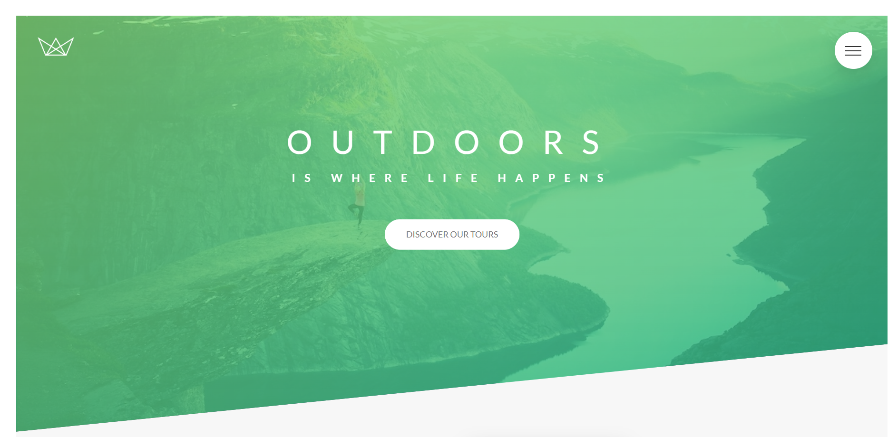

Project Highlights:

**🎨 Sass-Mastered Styling:**
- Harnessing the power of Sass, employs variables for colour definition, ensuring a harmonious and consistent visual identity.

**🏗️ Efficient Nesting Techniques:**
- Through strategic use of nesting and multiple classes, the project achieves a well-organized and readable stylesheet, making styling efficient and maintainable.

**🌐 Responsive Magic with Mixins:**
- Media queries become a breeze with mixins, enhancing code reusability and ensuring WanderSculpt Journeys is seamlessly responsive across various devices.

**🖼️ Intelligent Responsive Images:**
- Implemented intelligent responsive images, allowing browsers to dynamically select the best image sizes for optimal performance without compromising visual quality.

**🔗 Modular Codebase:**
The project's modular structure, facilitated by the @import rule, ensures a clean and organized codebase. Connecting all files in the main.scss file streamlines maintenance and collaboration.

**📱 Fully Responsive Design:**
- WanderSculpt Journeys adapts flawlessly to various screen sizes and devices, providing users with a visually stunning experience across desktops, tablets, and smartphones.

**📦 NPM Packages for Code Minimization:**
- Leveraging NPM packages, the project employs efficient code minimization strategies, resulting in lean and optimized CSS files for enhanced performance.

**💡 Innovative Approach to Visual Storytelling:**
- Modern animations and a captivating visual narrative elevate the user experience, setting WanderSculpt Journeys apart as a digital destination.

**🚀 Showcasing Sass Expertise:**
- By incorporating Sass features to their fullest potential, the project serves as a testament to Sass mastery, making it an intriguing exploration for developers keen on advanced styling techniques.

## ⚙️ How to Run Locally

1. Clone the repository  
   ```bash
   git clone https://github.com/FrontEndHighRoller/Natours-Landing-Page.git
2. Open index.html in your browser
3. Resize the screen to see responsive layouts and image switching in action 🎯

---

🙋‍♂️ Author
Dennis Rumanek

GitHub: https://github.com/FrontEndHighRoller

LinkedIn: https://www.linkedin.com/in/dennis-rumanek/

⭐ If you like this solution, feel free to star the repository!


